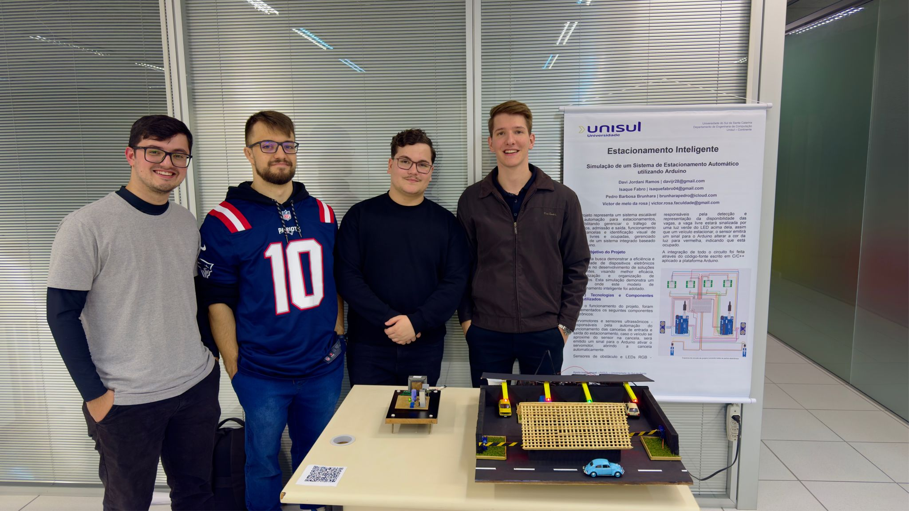

# 🚗 Estacionamento Inteligente com Arduino

## 📌 Sobre o Projeto

O **Estacionamento Inteligente** foi desenvolvido como parte da
disciplina de **Sistemas Digitais**.
Nosso objetivo foi criar um sistema automatizado capaz de gerenciar o
fluxo de veículos em um estacionamento, aplicando conceitos de
eletrônica digital, programação e automação.

O sistema utiliza **sensores ultrassônicos, LEDs RGB e servomotores**
controlados por dois **Arduino UNO**, simulando a abertura de cancelas e a
indicação de vagas disponíveis em tempo real.

------------------------------------------------------------------------

## ⚙️ Principais Desafios

-   Montagem e organização do circuito.
-   Ajuste fino da posição dos sensores para garantir leituras
    confiáveis.
-   Sincronização dos componentes, principalmente no controle das
    cancelas.
-   Desenvolvimento de uma lógica clara para leitura dos sinais e
    controle em tempo real.

------------------------------------------------------------------------

## 💻 Programação

A lógica foi implementada em **C++ (Arduino IDE)**, utilizando:
- Estruturas condicionais encadeadas para decisões em tempo real.
- Leitura de sinais digitais e analógicos.
- Controle **PWM** para movimentação dos servomotores.
- Lógica de detecção de presença de veículos e atualização de LEDs
indicadores.

------------------------------------------------------------------------

## 🛠️ Tecnologias Utilizadas

-   **Arduino UNO**
-   **Sensores Ultrassônicos (HC-SR04)**
-   **Sensores de Obstáculo**
-   **Servomotor** para controle da cancela
-   **LEDs RGB** para indicação de status
-   **Fonte de Alimentação** convertendo **220V AC → 13.2V DC** estável

------------------------------------------------------------------------

## 🚀 Funcionalidades

-   Identificação de vagas livres e ocupadas.
-   Abertura e fechamento automatizado da cancela.
-   Indicação em tempo real com LEDs.
-   Sistema de alimentação próprio para garantir estabilidade.

------------------------------------------------------------------------

## 📸 Demonstração

👉 Confira o projeto completo no **ThinkCard**: [Acessar
Projeto](https://www.tinkercad.com/things/69O015dd28H-surprising-amberis-blorr?sharecode=FMlOkKQXUy5yqs9k447a0y-v5OLxYr4jNJa3ugkWFQk)

------------------------------------------------------------------------

## 👨‍💻 Equipe de Desenvolvimento

-   Davi Jordani Ramos
-   Isaque Fabro
-   Pedro Brunhara
-   **Victor de Melo da Rosa**

------------------------------------------------------------------------

## 📚 Aprendizados

Esse projeto foi fundamental para consolidar conhecimentos em:
- Automação com microcontroladores.
- Integração entre hardware e software.
- Trabalho em equipe e divisão de tarefas.
- Prototipagem de soluções aplicadas ao cotidiano.

------------------------------------------------------------------------

## 🌍 Futuras Melhorias

-   Integração com aplicativo/web para monitoramento remoto.
-   Sistema de reservas de vagas.
-   Inclusão de sistema de pagamento automatizado.
-   Integração com IoT e dashboards de monitoramento.
